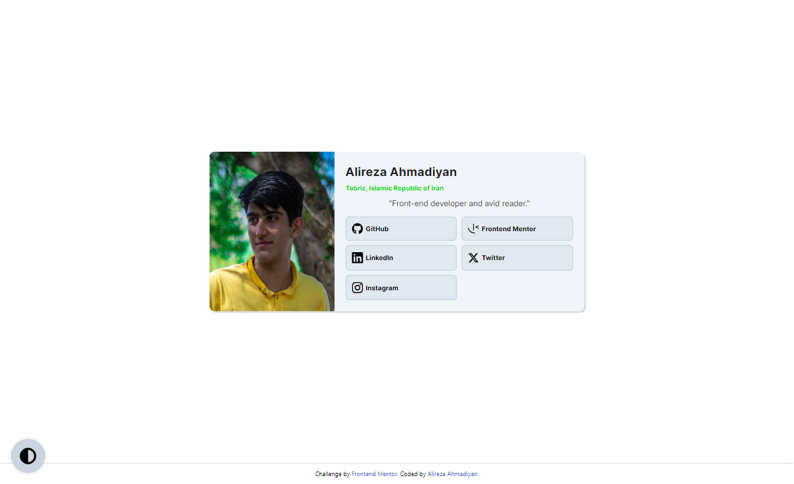
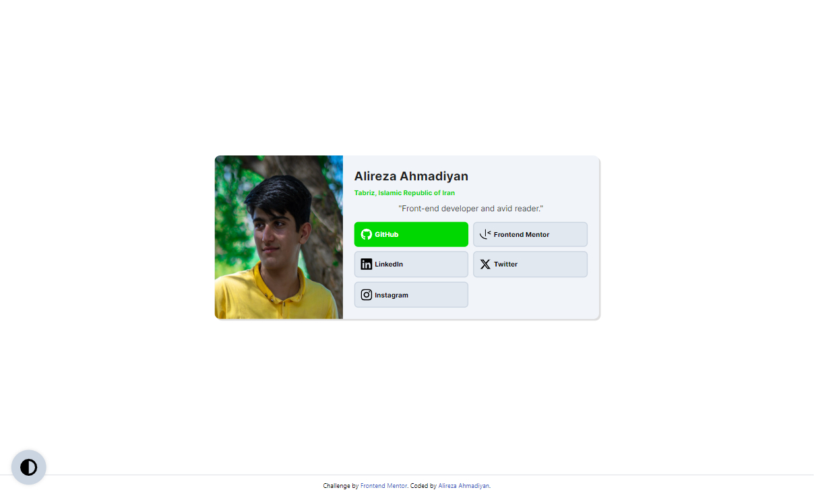
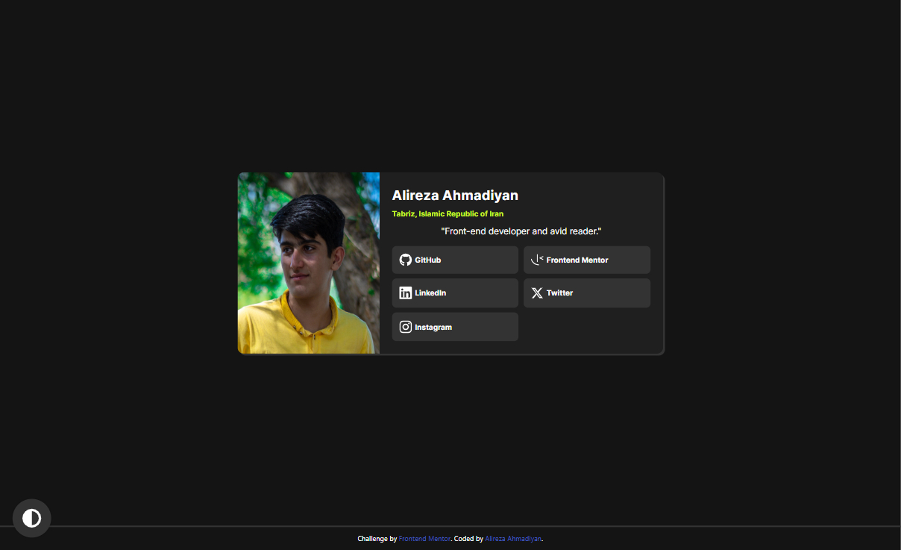
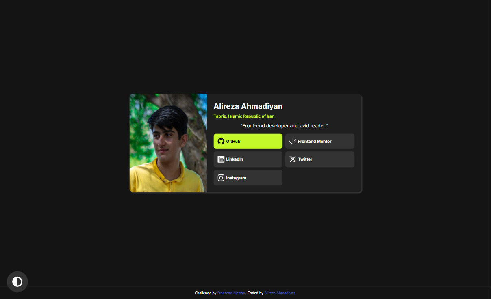
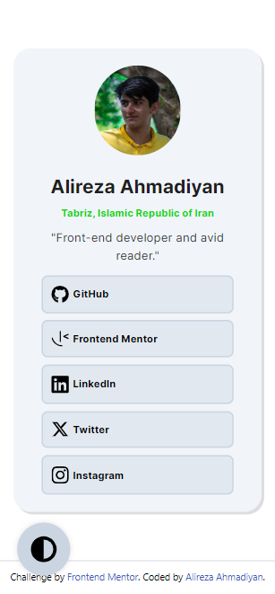
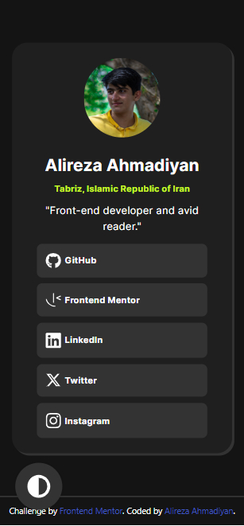

# Frontend Mentor - Social links profile solution

This is a solution to the [Social links profile challenge on Frontend Mentor](https://www.frontendmentor.io/challenges/social-links-profile-UG32l9m6dQ). Frontend Mentor challenges help you improve your coding skills by building realistic projects.

## Table of contents
 
- [Overview](#overview)
    - [Desktop Views](#desktop-views)
    - [Mobile Views](#mobile-views)
    - [Links](#links)
- [My process](#my-process)
    - [Built with](#built-with)
- [Author](#author)

## Overview
### Desktop Views

### Mobile Views

### Links

- Solution URL: [https://www.frontendmentor.io/solutions/social-profile-responsive-page-with-tailwindcss-nck599K_cT](https://www.frontendmentor.io/solutions/social-profile-responsive-page-with-tailwindcss-nck599K_cT)
- Live Site URL: [https://alireza-turk.github.io/Social_Profile](https://alireza-turk.github.io/Social_Profile)

## My process

### Built with

- Semantic HTML5 markup
- CSS custom properties
- Flexbox
- CSS Grid
- Desktop-first workflow
- [TailwindCSS](https://tailwindcss.com) Framework

## Author

- Alireza Ahmadiyan
- Frontend Mentor - [@alireza-turk](https://www.frontendmentor.io/profile/alireza-turk)